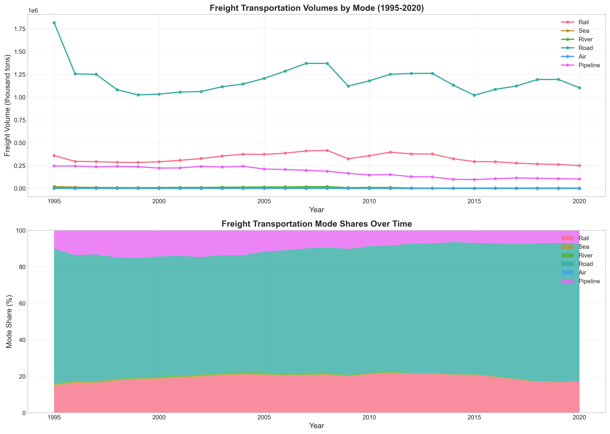
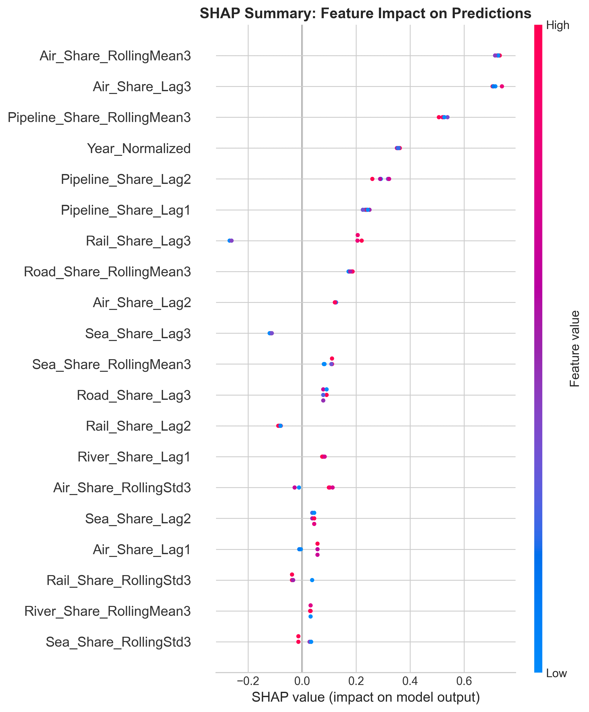
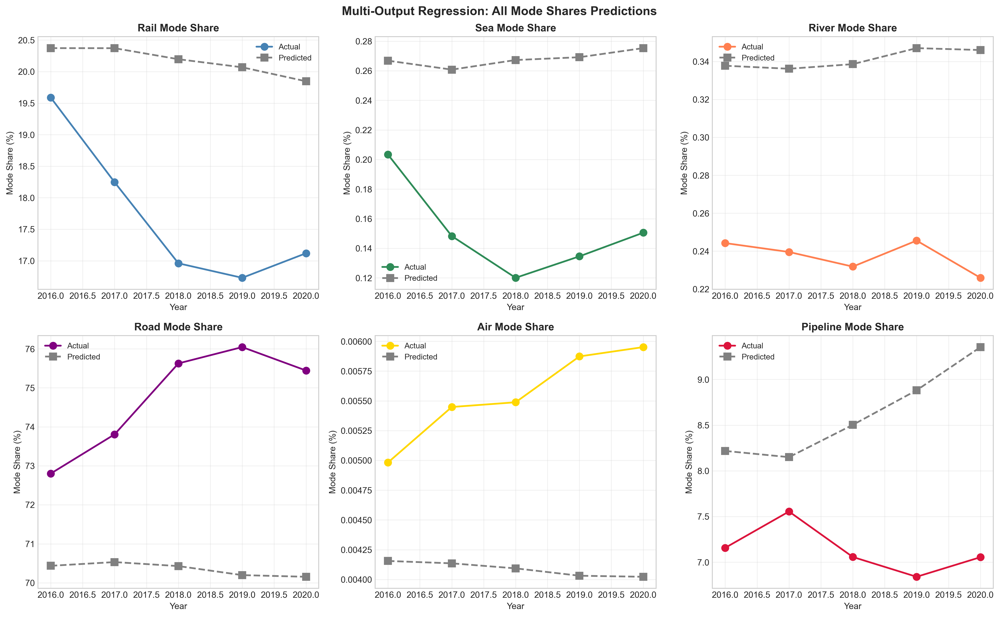

# Freight Transportation Mode Share Prediction System

A hybrid machine learning system for predicting freight transportation mode shares and identifying dominant transportation modes using ensemble methods with SHAP explainability.

## Overview

This project analyzes Ukraine's freight transportation data (1995-2020) to:
- Convert freight volumes into percentage mode shares
- Predict future mode share distributions using regression models
- Identify the dominant transportation mode per year
- Explain predictions using SHAP (SHapley Additive exPlanations)
- Generate actionable business and policy insights

## Dataset

Time-series dataset containing yearly freight volumes (in thousand tons) across six transportation modes:
- **Rail** - Railway shipments
- **Road** - Motor vehicles
- **Sea** - Maritime transport
- **River** - Inland waterway transport
- **Air** - Air freight
- **Pipeline** - Pipeline transport

## Features

### Data Preparation
- Data cleaning and validation
- Mode share computation (percentage of total freight)
- Dominant mode identification

### Feature Engineering
- **Lag features** (1-3 years) - Capture autoregressive patterns
- **Growth rates** - Year-over-year changes
- **Rolling means** (3-year window) - Smooth short-term fluctuations
- **Rolling volatility** - Capture stability/uncertainty

### Models

| Model Type | Algorithms |
|------------|------------|
| Regression | Random Forest, Gradient Boosting |
| Classification | Random Forest, Gradient Boosting |
| Multi-Output Regression | Predict all mode shares simultaneously |

### Evaluation Metrics
- **Regression**: MAE, RMSE, R²
- **Classification**: Accuracy, Macro F1, Confusion Matrix

### Explainability
- SHAP TreeExplainer for feature importance
- Summary plots showing feature impact direction
- Interpretable insights for non-technical stakeholders

## Installation

```bash
# Clone the repository
git clone https://github.com/sandeepgoriparthi/freight-mode-share-ml.git
cd freight-mode-share-ml

# Install dependencies
pip install pandas numpy matplotlib seaborn scikit-learn shap
```

## Usage

```bash
python freight_mode_share_ml.py
```

## Output Files

| File | Description |
|------|-------------|
| `mode_share_trends.png` | Volume and mode share trends over time |
| `feature_importance.png` | SHAP-based feature importance comparison |
| `model_comparison.png` | Regression and classification metrics |
| `predictions_vs_actual.png` | Single-target regression results |
| `multi_output_predictions.png` | All mode shares predictions |
| `shap_summary_regression.png` | SHAP beeswarm plot |
| `processed_freight_data.csv` | Feature-engineered dataset |

## Key Findings

### Mode Share Trends (1995-2020)

| Mode | 1995 | 2020 | Change |
|------|------|------|--------|
| Road | 74.0% | 75.4% | +1.5% |
| Rail | 14.7% | 17.1% | +2.5% |
| Pipeline | 10.0% | 7.1% | -2.9% |
| Sea | 0.85% | 0.15% | -0.7% |
| River | 0.52% | 0.23% | -0.3% |
| Air | 0.001% | 0.006% | +0.005% |

### Top Predictive Features (SHAP Analysis)
1. Air_Share_RollingMean3
2. Air_Share_Lag3
3. Pipeline_Share_RollingMean3
4. Year_Normalized
5. Pipeline_Share_Lag2

## Visualizations

### Mode Share Trends


### SHAP Feature Importance


### Multi-Output Predictions


## Policy Recommendations

1. **Road Infrastructure**: Road transport maintains >60% share - focus on maintenance and efficiency
2. **Rail Modernization**: Consider infrastructure upgrades and competitive pricing
3. **Maritime/River Revival**: Investigate port infrastructure and waterway navigability
4. **Air Freight Growth**: Prepare for increasing demand in time-sensitive goods
5. **Pipeline Planning**: Maintain stability for energy sector logistics

## Limitations

- Small dataset (26 years) limits model generalization
- Negative R² on test set indicates overfitting risk
- Classification is trivial (Road dominates 100% of years)

## Future Improvements

- Collect more granular data (monthly/quarterly)
- Include external features (GDP, fuel prices, trade policies)
- Implement cross-validation for small sample sizes
- Add forecasting capabilities with confidence intervals

## License

MIT License

## Author

Built with ensemble ML methods and SHAP explainability.
